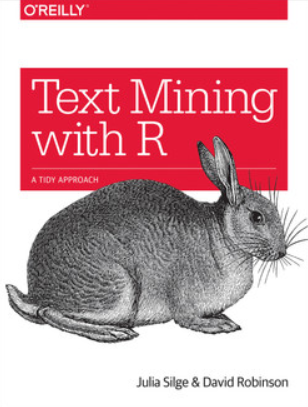
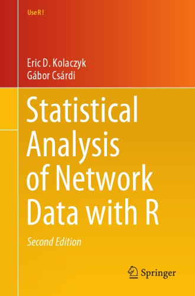

```{r setup, include=FALSE}
knitr::opts_chunk$set(echo = F)
knitr::opts_chunk$set(warning = FALSE)
knitr::opts_chunk$set(message = FALSE)
```


# Introducción

En el presente trabajo se realiza un análisis del discurso de rendición de Memoria y Cuenta del año 2022 del Presidente de la República Bolivariana de Venezuela Nicolás Maduro y las intervenciones del Ministro del Poder Popular para Agricultura Productiva y Tierras, Wilmar Castro Soteldo, de la Vicepresidenta ejecutiva de la República, Delcy Rodríguez y del Vicepresidente sectorial del Socialismo Social y Territorial, Mervin Maldonado, acto que se llevó a cabo en la sede de la Asamblea Nacional de Venezuela el jueves 12 de enero de 2023. Para tal fin, se quiere:

- Identificar palabras con mayor importancia.
- Cuantificar relaciones y conexiones entre palabras.

Adicionalmente, con el discurso de Nicolás Maduro, se efectúa un Análisis de Sentimientos, para lo cual se requirió la elaelaboración de los diccionarios de palabras positivas y negativas en el contexto del mismo, lo cual no necesariamente coincide con la ideología de cada persona.

Para el discurso e Maduro, se efectúa el análisis de pares de palabras, tomando en cuenta la palabras contiguas (bigrams) y las no contiguas (skip-diagrams), con lo cual podemos identificar las  relaciones entre pares de palabras más importantes.

Es importante resaltar, que este análisis es un ejercicio de clase del curso de Comprensión Lingüistica II del programa de estudios en Estadística, programa de pregrado adscrito a la Escuela de Estadística de la Facultad de Ciencias Económicas y Sociales (FACES) de la Universidad de Los Andes (ULA), Mérida, Venezuela del período académico E-2022-II (B-2022), actualmente en desarrollo.

```{r, eval = TRUE, echo=FALSE, out.width="75%", fig.pos = 'H', fig.align = 'center', fig.cap="Imagen tomada de de la publicación del discurso"}

```

Los desarrollos que se presentan a continuación están basados en las el trabajo de Agudelo, Leal y Sosa [Comparación de los discursos de posesión presidencial en Colombia: Uribe, Santos, Duque y Petro](https://rpubs.com/jstats1702/959088) donde se comparan los discursos de toma de posesión de los últimos cuatro Presidentes de Colombia.

El código, los datos y las imagenes relacionadas con este trabajo se encuentra disponible en este MODIFICAR ENLACE [enlace](https://github.com/borgesre/Analisis-del-discurso-de-Memoria-y-Cuenta-del-presidente-Nicolas-Maduro-del-12-de-enero-de-2023).

# Metodología

Lo primero eue hay que hacer es la  importación del discurso de Nicolás Maduro y la intervención los demás funcionarios que participaron en el acto de rendición de la Memoria y Cuenta, simplificándolo con la función `unlist` para producir un vector que contenga cada una de las líneas de texto.

```{r}
##### importar datos
suppressMessages(suppressWarnings(library(readr)))
suppressMessages(suppressWarnings(library(tidyverse)))
# Nicolás Maduro
text_maduro <- unlist(c(read_csv("DiscursoMaduroMyC2023.txt", col_names = FALSE, show_col_types = FALSE)))
names(text_maduro) <- NULL
# Cartro Soteldo
text_castrosoteldo <- unlist(c(read_csv("IntervencionCastroSoteldoMyC2023.txt", col_names = FALSE, show_col_types = FALSE)))
names(text_castrosoteldo) <- NULL
# Delcy Rodríguez
text_delcy <- unlist(c(read_csv("IntervencionDelcyRodriguezMyC2023.txt", col_names = FALSE, show_col_types = FALSE)))
names(text_delcy) <- NULL
# Mervin Maldonado
text_mervin <- unlist(c(read_csv("Intervencion;MervinMaldonadoMyC2023.txt", col_names = FALSE, show_col_types = FALSE)))
names(text_mervin) <- NULL
```

Posteriormente, los textos se almacenan en un objeto tipo `tibble`, entendido como una generalización del *data frame*, el cual permite manipular de forma más sencilla objetos "grandes" y no estructurados como los textos. 

```{r}
##### data frame formato tidy
# Nicolás Maduro
text_maduro <- tibble(line = 1:length(text_maduro), text = text_maduro) 
# Castro Soteldo
text_castrosoteldo <- tibble(line = 1:length(text_castrosoteldo), text = text_castrosoteldo)
# Delcy Rodríguez
text_delcy <- tibble(line = 1:length(text_delcy), text = text_delcy)
# Mervin Maldonado
text_mervin <- tibble(line = 1:length(text_mervin), text = text_mervin)
```

Para poder llevar a cabo el análisis, es necesario realizar la tokenización del texto, lo cual convierte cada palabra en la unidad de análisis de este caso de estudio, separándolas en una casilla particular. Además las funciones en `tidytext` ya realizan una buena exportación de los datos al convertir todas las mayúsculas en minúsculas y eliminar los signos de puntuación. 

```{r}
suppressMessages(suppressWarnings(library(tidytext)))
suppressMessages(suppressWarnings(library(magrittr)))
##### tokenizacion formato tidy
# ---------- maduro ----------
text_maduro %<>%
  unnest_tokens(input = text, output = word) %>%
  filter(!is.na(word))  # Eliminamos espacios en blanco
# dim(text_maduro)
# head(text_maduro, n = 8)
# ---------- castro soteldo ----------
text_castrosoteldo %<>%
  unnest_tokens(input = text, output = word) %>%
  filter(!is.na(word))
# dim(text_castrosoteldo)
# head(text_castrosoteldo, n = 8)
# ---------- delcy rodríguez ----------
text_delcy %<>%
  unnest_tokens(input = text, output = word) %>%
  filter(!is.na(word))
# dim(text_delcy)
# head(text_delcy, n = 8)
# ---------- mervin maldonado ----------
text_mervin %<>%
  unnest_tokens(input = text, output = word) %>%
  filter(!is.na(word))
# dim(text_mervin)
# head(text_mervin, n = 8)
```


Posteriormente,  se debe realizar una normalización del texto. Esta empieza con la decisión sobre si se deben conservar los números presentes en los discursos o no. La búsqueda de caracteres numéricos para cada discurso se muestra a continuación.

```{r, eval = F}
# ---------- maduro ----------
text_maduro %>%
  filter(grepl(pattern = '[0-9]', x = word)) %>% 
  count(word, sort = TRUE)
# ---------- castro soteldo ----------
text_castrosoteldo %>%
  filter(grepl(pattern = '[0-9]', x = word)) %>% 
  count(word, sort = TRUE)
# ---------- delcy rodríguez ----------
text_delcy %>%
  filter(grepl(pattern = '[0-9]', x = word)) %>% 
  count(word, sort = TRUE)
# ---------- mervin maldonado ----------
text_mervin %>%
  filter(grepl(pattern = '[0-9]', x = word)) %>% 
  count(word, sort = TRUE)
```

Se observa que el discurso del presidente Nicolás Maduro tienen una significativa fecuencias de números (años, porcentajes, números absolutos, etc.). Aunque los números pueden representar cifras significativas en el momento histórico particular, estos no serán considerados en la comparación de los discursos, así se procede a eliminar estos registros. 

```{r}
##### remover texto con numeros
# ---------- maduro ----------
text_maduro %<>%
  filter(!grepl(pattern = '[0-9]', x = word))
# dim(text_maduro)
# ---------- castro soteldo ----------
text_castrosoteldo %<>%
  filter(!grepl(pattern = '[0-9]', x = word))
# dim(text_castrosoteldo)
# ---------- delcy rodriguez ----------
text_delcy %<>%
  filter(!grepl(pattern = '[0-9]', x = word))
# dim(text_delcy)
# ---------- mervin maldonado ----------
text_mervin %<>%
  filter(!grepl(pattern = '[0-9]', x = word))
# dim(text_mervin)
```


Luego que se han eliminado los números , se procede a la eliminación de palabras de parada, debiéndose primero hacerse la carga de una lista de *stop words* con 451 palabras en español que permiten eliminar todas las palabras que no aportan información relevante para este análisis, como conectores, artículos o verbos auxiliares de uso común. Una vez hecho esto, se reducen considerablemente la cantidad de registros en los archivos. 

```{r}
###### stop words 
stop_words_es <- tibble(word = unlist(c(read.table("stop_words_spanish.txt", quote="\"", comment.char=""))), lexicon = "custom")
# dim(stop_words_es)
```

```{r}
##### remover stop words
# ---------- maduro ----------
text_maduro %<>% 
  anti_join(x = ., y = stop_words_es)
# dim(text_maduro)
# head(text_maduro, n = 8)
# ---------- castro soteldo ----------
text_castrosoteldo %<>% 
  anti_join(x = ., y = stop_words_es)
# dim(text_castrosoteldo)
# head(text_castrosoteldo, n = 8)
# ---------- delcy rodríguez ----------
text_delcy %<>% 
  anti_join(x = ., y = stop_words_es)
# dim(text_delcy)
# head(text_delcy, n = 8)
# ---------- mervin maldonado ----------
text_mervin %<>% 
  anti_join(x = ., y = stop_words_es)
#dim(text_mervin)
#head(text_mervin, n = 8)
```

Para finalizar con la normalización, se remueven los acentos del idioma español después de eliminar las *stop words*, así se evita remover palabras que sin acento hubieran podido ser eliminadas en el paso anterior.

```{r}
##### remover acentos
replacement_list <- list('á' = 'a', 'é' = 'e', 'í' = 'i', 'ó' = 'o', 'ú' = 'u')
# ---------- maduro ----------
text_maduro %<>% 
  mutate(word = chartr(old = names(replacement_list) %>% str_c(collapse = ''), 
                       new = replacement_list %>% str_c(collapse = ''),
                       x = word))
# ---------- castro soteldo ----------
text_castrosoteldo %<>% 
  mutate(word = chartr(old = names(replacement_list) %>% str_c(collapse = ''), 
                       new = replacement_list %>% str_c(collapse = ''),
                       x = word))
# ---------- delcy rodriguez ----------
text_delcy %<>% 
  mutate(word = chartr(old = names(replacement_list) %>% str_c(collapse = ''), 
                       new = replacement_list %>% str_c(collapse = ''),
                       x = word))
# ---------- mervin maldonado ----------
text_mervin %<>% 
  mutate(word = chartr(old = names(replacement_list) %>% str_c(collapse = ''), 
                       new = replacement_list %>% str_c(collapse = ''),
                       x = word))
```


# Tokens más frecuentes

Una vez hecho el tratamiento a estas bases de datos, se realiza un conteo de las palabras y se identifican las modas o las palabras más frecuentes para cada uno de los discursos. A continuación se presentan el top 10 en cada caso.

```{r, eval = F}
##### top 10 de tokens mas frecuentes
# ---------- maduro ----------
text_maduro %>% 
  count(word, sort = TRUE) %>%
  head(n = 10)
# ---------- castro soteldo ----------
text_castrosoteldo %>% 
  count(word, sort = TRUE)  %>%
  head(n = 10)
# ---------- delcy rodríguez ----------
text_delcy %>% 
  count(word, sort = TRUE)  %>%
  head(n = 10)
# ---------- mervin maldonado ----------
text_mervin %>% 
  count(word, sort = TRUE)  %>%
  head(n = 10)
```

Se observan diferencias en las palabras más fecuentes, y esto es debido a la naturaleza de los cargos, adicionalmentye, cabe recordar que en el el discurso de Nicolás Maduro es mucho más largo  que las intervenciones de los otros funcionarios. Para una mejor visualización se presenta un diagrama de barras con las frecuencias de las palabras para cada discurso. En el caso de Maduro se establece un filtro en la frecuencia mayor que 9 y para los otros funcionarios el filtro es de 2.

```{r, fig.width=11, fig.height=12, fig.align='center', echo=FALSE}
library(gridExtra)
# ---------- maduro ----------
text_maduro %>%
  count(word, sort = TRUE) %>%
  filter(n > 9) %>%
  mutate(word = reorder(word, n)) %>%
  ggplot(aes(x = word, y = n)) +
    theme_light() + 
    geom_col(fill = '#00FF7F', alpha = 0.8) +
    xlab(NULL) +
    ylab("Frecuencia") +
    coord_flip() +
    ggtitle(label = 'Maduro: Conteo de palabras') -> p1
# ---------- castro soteldo ----------
text_castrosoteldo %>%
  count(word, sort = TRUE) %>%
  filter(n > 2) %>%
  mutate(word = reorder(word, n)) %>%
  ggplot(aes(x = word, y = n)) +
    theme_light() + 
    geom_col(fill = 'blue4', alpha = 0.8) +
    xlab(NULL) +
    ylab("Frecuencia") +
    coord_flip() +
    ggtitle(label = 'Castro S: Conteo de palabras') -> p2
# ---------- delcy rodríguez ----------
text_delcy %>%
  count(word, sort = TRUE) %>%
  filter(n > 2) %>%
  mutate(word = reorder(word, n)) %>%
  ggplot(aes(x = word, y = n)) +
    theme_light() + 
    geom_col(fill = '#FFFF00', alpha = 0.8) +
    xlab(NULL) +
    ylab("Frecuencia") +
    coord_flip() +
    ggtitle(label = 'Delcy: Conteo de palabras') -> p3
# ---------- mervin maldonado ----------
text_mervin %>%
  count(word, sort = TRUE) %>%
  filter(n > 2) %>%
  mutate(word = reorder(word, n)) %>%
  ggplot(aes(x = word, y = n)) +
    theme_light() + 
    geom_col(fill = '#EE0000', alpha = 0.8) +
    xlab(NULL) +
    ylab("Frecuencia") +
    coord_flip() +
    ggtitle(label = 'Mervin: Conteo de palabras') -> p4
# desplegar grafico
grid.arrange(p1, p2, p3, p4, ncol = 2)
```

Como una alternativa para mejorar la visualización se realizan nubes de palabras, que ilustra un máximo de 25 palabras para cada discurso cuyo tamaño es proporcional a su frecuencia en los textos 

```{r, fig.width=12, fig.height=9, fig.align='center', echo=FALSE}
library(wordcloud)
par(mfrow = c(2,2), mar = c(1,1,2,1), mgp = c(1,1,1), cex.main=2.5 )
# ---------- maduro ----------
set.seed(176)
text_maduro %>%
  count(word, sort = TRUE) %>%
  with(wordcloud(words = word, freq = n, max.words = 25, colors = '#00FF7F'))
title(main = "Maduro")
# ---------- castro soteldo ----------
set.seed(176)
text_castrosoteldo %>%
  count(word, sort = TRUE) %>%
  with(wordcloud(words = word, freq = n, max.words = 25, colors = 'blue4'))
title(main = "Castro Soteldo")
# ---------- delcy rodríguez ----------
set.seed(176)
text_delcy %>%
  count(word, sort = TRUE) %>%
  with(wordcloud(words = word, freq = n, max.words = 25, colors = '#FFFF00'))
title(main = "Delcy")
# ---------- mervin maldonado ----------
set.seed(176)
text_mervin %>%
  count(word, sort = TRUE) %>%
  with(wordcloud(words = word, freq = n, max.words = 25, colors = '#EE0000'))
title(main = "Mervin")
```

Ahora, para poder realizar comparaciones más directas entre los discursos, primero se calculan las frecuencias relativas de todas las palabras que son mencionadas en ellos, por lo cual, algunas tendrán frecuencia cero si no fueron mencionadas dentro de las alocución del respectivo funcionario.

```{r}
##### frecuencias relativas de las palabras
bind_rows(mutate(.data = text_maduro, author = "maduro"),
                       mutate(.data = text_castrosoteldo, author = "castrosoteldo"),
                       mutate(.data = text_delcy, author = "delcy"),
                       mutate(.data = text_mervin, author = "mervin")) %>%
  count(author, word) %>%
  group_by(author) %>%
  mutate(proportion = n/sum(n)) %>%
  select(-n) %>%
  spread(author, proportion, fill = 0) -> frec  # importante!
frec %<>% 
  select(word, maduro, castrosoteldo, delcy, mervin)
# dim(frec)
# head(frec, n = 10)
```

En la siguiente tabla se ordenan de forma anidada, de acuerdo a los respectivos periodos presidenciales, desde el actual hasta el más antiguo, las 15 palabras más frecuentes en común entre los discursos. 

```{r}
# orden anidado respecto al presidente maduro 
frec %>%
  filter(maduro !=0, castrosoteldo != 0, delcy!=0, mervin!=0) %>%
  arrange(desc(maduro), desc(castrosoteldo), desc(delcy), desc(mervin)) -> frec_comun
# dim(frec_comun)
head(frec_comun, n = 15)
```

Además, se encuentra que de todas las palabras en conjunto, solo el 0.33% son mencionadas en los 4 discursos.

```{r, eval = F}
###### proporcion palabras en comun
dim(frec_comun)[1]/dim(frec)[1]
```

Una vez calculadas las frecuencias, se deciden calcular los coeficientes de correlación lineal de Pearson entre cada par de alocuciones para evaluar que tan parecidos son sus contenidos.

```{r}
suppressMessages(suppressWarnings(library(gtools)))
Pres <- c("Maduro","CastroS","Delcy","Mervin")
comb <- combinations(4, 2, 2:5)
frec <- as.data.frame(frec)
frec_comun <- as.data.frame(frec_comun)
Tab <- matrix(0,6,2)
for(i in 1:6){
Tab[i,1] <- cor.test(x = frec[,comb[i,1]], y = frec[,comb[i,2]])$estimate
Tab[i,2] <- cor.test(x = frec_comun[,comb[i,1]], y = frec_comun[,comb[i,2]])$estimate
}
Tabla <- cbind(Pres[combinations(4, 2, 1:4)[,1]], Pres[combinations(4, 2, 1:4)[,2]], round(Tab,3))
colnames(Tabla) <- c("Discurso 1 ", "Discurso 2", "Corr P. Total","Corr P. común")
```


```{r, include=FALSE}
library(xtable)
print(xtable(Tabla,align=c("c","c","c","c","c")), type = "html")
```

<table border=1>
<tr> <th>  </th> <th> Discurso 1  </th> <th> Discurso 2 </th> <th> Corr P. Total </th> <th> Corr P. común </th>  </tr>
  <tr> <td align="center"> 1 </td> <td align="center"> Maduro </td> <td align="center"> CastroS </td> <td align="center"> 0.26 </td> <td align="center"> -0.272 </td> </tr>
  <tr> <td align="center"> 2 </td> <td align="center"> Maduro </td> <td align="center"> Delcy </td> <td align="center"> 0.416 </td> <td align="center"> 0.612 </td> </tr>
  <tr> <td align="center"> 3 </td> <td align="center"> Maduro </td> <td align="center"> Mervin </td> <td align="center"> 0.359 </td> <td align="center"> -0.009 </td> </tr>
  <tr> <td align="center"> 4 </td> <td align="center"> CastroS </td> <td align="center"> Delcy </td> <td align="center"> 0.23 </td> <td align="center"> 0.231 </td> </tr>
  <tr> <td align="center"> 5 </td> <td align="center"> CastroS </td> <td align="center"> Mervin </td> <td align="center"> 0.185 </td> <td align="center"> 0.382 </td> </tr>
  <tr> <td align="center"> 6 </td> <td align="center"> Delcy </td> <td align="center"> Mervin </td> <td align="center"> 0.237 </td> <td align="center"> 0.025 </td> </tr>
   </table>

## Conclusiones de los conteos

Se observan diferencias en las palabras de las intervenciones de los cuatro funcionarios.

Por otro lado, en el conteo de los registros, es evidente que el número de palabras en el discurso de Maduro es mucho más variable que para los otros tres funcionarios, por este motivo, el tamaño y el número de las palabras en los gráficos de nube para se afactan por este hecho. 

Las palabras en común a los 4 discursos, con una proporción del 0.33%, muestran la cvompetencia de los funcionarios, se resaltar palabras como "venezuela", “pueblo”, "nacioanal", "año" y las correlaciones muestran diferencias entre las intervenciones de los funncionarios subalternos, lo cual era de esperarse por su área de competencia.


# Análisis de sentimiento

El siguiente paso es realizar un análisis de sentimiento de las palabras en cada texto. Para esto, se utiliza un diccionario pre-existente (y editado según el interés del estudio) de palabras "positivas" y uno de palabras consideradas como "negativas".

```{r}
# diccionarios
positive_words <- read_csv("positive_words2_es.txt", col_names = "word", show_col_types = FALSE) %>%
  mutate(sentimiento = "Positivo")
negative_words <- read_csv("negative_words2_es.txt", col_names = "word", show_col_types = FALSE) %>%
  mutate(sentimiento = "Negativo")
sentiment_words <- bind_rows(positive_words, negative_words)
#sentiment_words %>%
#  count(sentimiento)
```

Con estos diccionarios es posible crear un gráfico de barras para  mostrando las palabras positivas y negativas, y para poder visualizar las palabras consideremos las palabras con una frecuencia, mayor que 8.

```{r, fig.width=4, fig.height=3, fig.align='center', echo=FALSE}
###### viz
library(RColorBrewer)
# ---------- maduro ----------
text_maduro %>%
  inner_join(sentiment_words) %>%
  count(word, sentimiento, sort = TRUE) %>%
  filter(n > 8) %>%
  mutate(n = ifelse(sentimiento == "Negativo", -n, n)) %>%
  mutate(word = reorder(word, n)) %>%
  ggplot(aes(word, n, fill = sentimiento)) +
    geom_col() +
    scale_fill_manual(values = brewer.pal(8,'Set1')[c(1,3)]) +
    coord_flip(ylim = c(-7,7)) +
    labs(y = "Frecuencia",
         x = NULL,
         title = "Maduro: Conteo por sentimiento") +
    theme_minimal() -> p1
p1
```


Para visualizar la mayoría de las palabras (aunque son muy dificiles de diastinguir) elaboremos ungráfico de barras para  mostrando las palabras positivas y negativas con una frecuencia mayor que 2.

```{r, fig.width=4, fig.height=3, fig.align='center', echo=FALSE}
###### viz
library(RColorBrewer)
# ---------- maduro ----------
text_maduro %>%
  inner_join(sentiment_words) %>%
  count(word, sentimiento, sort = TRUE) %>%
  filter(n > 2) %>%
  mutate(n = ifelse(sentimiento == "Negativo", -n, n)) %>%
  mutate(word = reorder(word, n)) %>%
  ggplot(aes(word, n, fill = sentimiento)) +
    geom_col() +
    scale_fill_manual(values = brewer.pal(8,'Set1')[c(1,3)]) +
    coord_flip(ylim = c(-7,7)) +
    labs(y = "Frecuencia",
         x = NULL,
         title = "Maduro: Conteo por sentimiento") +
    theme_minimal() -> p1
p1
```

De manera similar a los conteos anteriores, es posible graficar una nube de máximo 50 palabras, distinguiendo las positivas de las negativas para poder realizar una comparación más sencilla.


```{r, fig.width=10, fig.height=11, fig.align='center', echo=FALSE}
suppressMessages(suppressWarnings(library(reshape2)))  # acast
##### viz
par(cex.main=2)
# ---------- maduro ----------
set.seed(176)
text_maduro %>%
  inner_join(sentiment_words) %>%
  count(word, sentimiento, sort = TRUE) %>%
  acast(word ~ sentimiento, value.var = "n", fill = 0) %>%
  comparison.cloud(colors = brewer.pal(8,'Set1')[c(1,3)], 
                   max.words = 50, title.size = 1.2)
title(main = "Maduro")

```

## Conclusiones para los sentimientos

En general, por medio de los diagramas de barras, se observa que son más la cantidad de palabras positivas mencionadas en los discursos que las palabras negativas, además de que se mencionan con frecuencias considerablemente mayores.

Se encontra que las palabras positivas que comparten más recurrentemente están asociadas al populismo, entre ellas, “pueblo”, “social”, “crecimiento”, "fuerza", "popular" y "vida". 

En cuanto a las palabras negativas, las más comunes están relacionadas a temas asociados a excusas para el incumplimiento de la fgestión gubernamental, como “guerra”(probalmente asociada a "economica"), "sanciones", "derecha", "rebelion", "extremista" y "persecusion".


# Bigramas

Todo el análisis presentado hasta el momento se ha basado en procedimientos para unigramas. Ahora se presentarán resultados teniendo en cuenta los bigramas. Para esto, debemos realizar nuevamente la importación de los textos originales.

```{r}
##### importar datos
text_maduro <- unlist(c(read_csv("DiscursoMaduroMyC2023.txt", col_names = FALSE, show_col_types = FALSE)))
names(text_maduro) <- NULL
text_maduro <- tibble(line = 1:length(text_maduro), text = text_maduro)
```

Una vez importados, la tokenización ya no será realizada por cada palabra, sino que las nuevas unidades de análisis serán todos los pares de palabras presentes en los discursos.

```{r, eval}
##### tokenizar en bigramas
# maduro
text_maduro %>%
  unnest_tokens(tbl = ., input = text, output = bigram, token = "ngrams", n = 2) %>%
  filter(!is.na(bigram)) -> text_maduro_bi 
#dim(text_maduro_bi)
#head(text_maduro_bi, n = 8)
```

Nuevamente, se eliminan cualquier par de palabras que contenga una *stop word*, puesto que siguen sin aportar información relevante. Sin embargo, en este paso se separa cada palabra en una columna distinta, y en una tercera columna del archivo se almacena la frecuencia de esta pareja, lo cual será útil para la conformación de la red de los discursos. 

```{r}
##### omitir stop words
text_maduro_bi %>%
  separate(bigram, c("word1", "word2"), sep = " ") %>%
  filter(!grepl(pattern = '[0-9]', x = word1)) %>%
  filter(!grepl(pattern = '[0-9]', x = word2)) %>%
  filter(!word1 %in% stop_words_es$word) %>%
  filter(!word2 %in% stop_words_es$word) %>%
  mutate(word1 = chartr(old = names(replacement_list) %>% str_c(collapse = ''), 
                       new = replacement_list %>% str_c(collapse = ''),
                       x = word1)) %>%
  mutate(word2 = chartr(old = names(replacement_list) %>% str_c(collapse = ''), 
                       new = replacement_list %>% str_c(collapse = ''),
                       x = word2)) %>%
  filter(!is.na(word1)) %>% 
  filter(!is.na(word2)) %>%
  count(word1, word2, sort = TRUE) %>%
  rename(weight = n) -> text_maduro_bi_counts  # importante para la conformacion de la red!
# dim(text_maduro_bi_counts)
# head(text_maduro_bi_counts, n = 10)
```

A continuación se da inicio al estudio a los discursos por medio de las metodologías estadísticas para el análisis de redes sociales. Para cada texto se crea un grafo no dirigido donde cada nodo es una palabra y existe una relación entre cada vértice si se evidenció un bigrama para estas dos palabras en el discurso. Además, este grafo está ponderado por la frecuencia observada del bigrama.  

```{r, fig.width=10, fig.height=10, fig.align='center'}
##### definir una red a partir de la frecuencia (weight) de los bigramas
suppressMessages(suppressWarnings(library(igraph)))
g_maduro <- text_maduro_bi_counts %>%
  filter(weight > 0) %>%
  graph_from_data_frame(directed = FALSE)
# viz
#par(mfrow = c(2,2), cex.main = 2.5)
set.seed(176)
plot(g_maduro,  layout = layout_with_fr, vertex.color = 6, vertex.frame.color = 1, vertex.size = 3, vertex.label = NA, main = " Red de Maduro")
```

En el siguiente gráfico se muestran las componentes conexas más grandes en cada red, pero las etiquetas se omiten en las figuras de las estructuras de estas componentes para la red para una mejor visualización. Además, el tamaño de los nodos es proporcional a la fuerza de los mismos.   

```{r, fig.width=10, fig.height=10, fig.align='center', echo=FALSE}
##### componente conexa mas grande de la red
# grafo inducido por la componente conexa
V(g_maduro)$cluster <- clusters(graph = g_maduro)$membership
gcc_maduro <- induced_subgraph(graph = g_maduro, vids = which(V(g_maduro)$cluster == which.max(clusters(graph = g_maduro)$csize)))
par(cex.main=2)
set.seed(176)
plot(gcc_maduro, layout = layout_with_kk, vertex.color = adjustcolor('#FF6347', 0.1), vertex.frame.color = '#FF6347', vertex.size = 2*strength(gcc_maduro), vertex.label.color = 'black', vertex.label.cex = 1, vertex.label.dist = 1, edge.width = 3*E(g_maduro)$weight/max(E(g_maduro)$weight),edge.color="#FF8247", main = " Componente de maduro")
```

Para una mejor interpretación, se crea nuevamente la red para los bigramas del discurso de Maduro pero filtrando por los que tengan una frecuencia mayor o igual que 2. 

```{r, fig.width=10, fig.height=10, fig.align='center', echo=FALSE}
par(cex.main=2)
g_maduro2 <- text_maduro_bi_counts %>%
  filter(weight > 2) %>%
  graph_from_data_frame(directed = FALSE)
set.seed(176)
plot(g_maduro2, layout = layout_with_kk, vertex.color = 6, vertex.frame.color = 4, vertex.label.color = 'black', vertex.label.cex = 2, vertex.label.dist = 1, vertex.size=strength(g_maduro2), main = "Maduro")
```

A partir de la componente gigante se calculan las principales estadísticas descriptivas para cada red, las cuales nos permitirán observar de una mejor manera la cohesión en el discurso. 

```{r, include = F}
tab <- cbind(
  c(mean_distance(gcc_maduro), mean(degree(gcc_maduro)), sd(degree(gcc_maduro)), clique.number(gcc_maduro), edge_density(gcc_maduro), transitivity(gcc_maduro), assortativity_degree(gcc_maduro)))
rownames(tab) <- c("Dist. media","Grado media","Grado desviación","Número clan","Densidad","Transitividad","Asortatividad")
colnames(tab) <- c("Maduro")
library(xtable)
print(xtable(tab,align=c("c","c")), type = "html")
```

<table border=1>
<tr> <th>  </th> <th> Maduro </th>  </tr>
  <tr> <td align="center"> Dist. media </td> <td align="center"> 8.63 </td> </tr>
  <tr> <td align="center"> Grado media </td> <td align="center"> 2.36 </td> </tr>
  <tr> <td align="center"> Grado desviación </td> <td align="center"> 2.76 </td> </tr>
  <tr> <td align="center"> Número clan </td> <td align="center"> 4.00 </td> </tr>
  <tr> <td align="center"> Densidad </td> <td align="center"> 0.00 </td> </tr>
  <tr> <td align="center"> Transitividad </td> <td align="center"> 0.02 </td> </tr>
  <tr> <td align="center"> Asortatividad </td> <td align="center"> -0.08 </td> </tr>
   </table>
   
## Conclusiones de los bigramas

Los principales pares de palabras observados son "republica bolivariana", "fuerza armada", "cadena nacional", "simon bolivar", "asamblea constituyente" "siglo xxi", "invitados especiales", "guerra economica", "politica social", "hugo chavez" y "derechos sociales"

# Skip-grams

Otra forma de realizar el análisis de los bigramas es por medio de los skip-gramas. Método en el cual se crean parejas de palabras omitiendo una palabra de por medio.

```{r}
#tokenizar en skip-gram
text_maduro %>%
  unnest_tokens(tbl = ., input = text, output = skipgram, token = "skip_ngrams", n = 2) %>%
  filter(!is.na(skipgram)) -> text_maduro_skip
#dim(text_maduro_skip)
```

Lo anterior almacena primero cada palabra, luego los bigramas usuales y por último el bigrama obtenido de eliminar la palabra de por medio. De este modo, se hace el conteo de palabras en cada fila, para eliminar los unigramas que ya fueron analizados anteriormente.  

```{r}
suppressMessages(suppressWarnings(library(ngram)))
# contar palabras en cada skip-gram
text_maduro_skip$num_words <- text_maduro_skip$skipgram %>% 
  map_int(.f = ~ wordcount(.x))
# remover unigramas
text_maduro_skip %<>% 
  filter(num_words == 2) %>% 
  select(-num_words)
dim(text_maduro_skip)
```

Una vez más, se decartan todos los registros que contengan alguna *stop word*, y simultáneamente se eliminan los registros que contenían algún número.

```{r}
##### omitir stop words
text_maduro_skip %>%
  separate(skipgram, c("word1", "word2"), sep = " ") %>%
  filter(!grepl(pattern = '[0-9]', x = word1)) %>%
  filter(!grepl(pattern = '[0-9]', x = word2)) %>%
  filter(!word1 %in% stop_words_es$word) %>%
  filter(!word2 %in% stop_words_es$word) %>%
  mutate(word1 = chartr(old = names(replacement_list) %>% str_c(collapse = ''), 
                       new = replacement_list %>% str_c(collapse = ''),
                       x = word1)) %>%
  mutate(word2 = chartr(old = names(replacement_list) %>% str_c(collapse = ''), 
                       new = replacement_list %>% str_c(collapse = ''),
                       x = word2)) %>%
  filter(!is.na(word1)) %>% 
  filter(!is.na(word2)) %>%
  count(word1, word2, sort = TRUE) %>%
  rename(weight = n) -> text_maduro_skip_counts
#dim(text_maduro_skip_counts)
```

Ahora, se crea el grafo del discursos con base en el skipgrama. A continuación se grafica la componente conexa más grande en cada discurso.

```{r}
### maduro #########################
g2_maduro <- text_maduro_skip_counts %>%
  filter(weight > 0) %>%
  graph_from_data_frame(directed = FALSE)
g2_maduro <- igraph::simplify(g2_maduro)
V(g2_maduro)$cluster <- clusters(graph = g2_maduro)$membership
gcc2_maduro <- induced_subgraph(graph = g2_maduro, vids = which(V(g2_maduro)$cluster == which.max(clusters(graph = g2_maduro)$csize)))
```


```{r, fig.width=10, fig.height=10, fig.align='center', echo=FALSE}
par(cex.main=2)
# visualización
set.seed(176)
plot(gcc2_maduro, layout = layout_with_drl, vertex.color = adjustcolor('#FF6347', 0.1), vertex.frame.color = '#FF6347', vertex.size = strength(gcc2_maduro), vertex.label = NA, main="Maduro",edge.color="#EECFA1")
title(main = "Componente conexa", outer = T, line = -1)
```

Nuevamente se calculan las principales estadísticas descriptivas para estas nuevas redes, con el mismo propósito interpretativo.

```{r, include=FALSE}
tab <- cbind(
  c(mean_distance(gcc2_maduro), mean(degree(gcc2_maduro)), sd(degree(gcc2_maduro)), clique.number(gcc2_maduro), edge_density(gcc2_maduro), transitivity(gcc2_maduro), assortativity_degree(gcc2_maduro)))
rownames(tab) <- c("Dist. media","Grado media","Grado desviación","Número clan","Densidad","Transitividad","Asortatividad")
colnames(tab) <- c("Maduro")
library(xtable)
print(xtable(tab,align=c("c","c")), type = "html")
```

<table border=1>
<tr> <th>  </th> <th> Maduro </th>  </tr>
  <tr> <td align="center"> Dist. media </td> <td align="center"> 6.01 </td> </tr>
  <tr> <td align="center"> Grado media </td> <td align="center"> 3.37 </td> </tr>
  <tr> <td align="center"> Grado desviación </td> <td align="center"> 5.03 </td> </tr>
  <tr> <td align="center"> Número clan </td> <td align="center"> 4.00 </td> </tr>
  <tr> <td align="center"> Densidad </td> <td align="center"> 0.00 </td> </tr>
  <tr> <td align="center"> Transitividad </td> <td align="center"> 0.06 </td> </tr>
  <tr> <td align="center"> Asortatividad </td> <td align="center"> -0.05 </td> </tr>
   </table>
   
## Palabras más importantes

Una ventaja de realizar el análisis de redes con los bigramas y skipgramas, es que podemos hacer una clasificación del top 10 de las palabras más importantes en cada alocución, por medio de medidas como la centralidad propia de los vértices. Cabe aclarar que este tipo de centralidad nos mostrará las palabras de mayor importancia de acuerdo a la importancia de las demás palabras con las que se relacionan.  

### Maduro: Top 10 {-}

```{r, echo = F}
centralidad_maduro <- tibble(word = V(gcc2_maduro)$name, eigen = eigen_centrality(gcc2_maduro, scale = T)$vector)
centralidad_maduro %>%
  arrange(desc(eigen)) %>%
  head(n = 10)
```


## Agrupamiento

Finalmente, para concluir el análisis a los discursos se realiza un agrupamiento en cada una de las componentes gigantes de estos últimos grafos creados a partir de los skip-gramas. Los grupos resultantes son útiles para identificar los distintos tipos de temáticas dentro de los discursos. Adicionalmente, se observa el top 5 de palabras más importantes, de acuerdo a la centralidad propia, dentro del grupo con mayor cantidad de vértices en cada agrupamiento.

```{r, include=F}
kc_maduro <- igraph::cluster_fast_greedy(gcc2_maduro)
tab <- cbind(
  c(length(kc_maduro), min(sizes(kc_maduro)), max(sizes(kc_maduro))))
rownames(tab) <- c("Tamaño partición", "Tamaño grupo menor", "Tamaño grupo mayor")
colnames(tab) <- c("Maduro")
print(xtable(tab,align=c("c","c")), type = "html")
```

<table border=1>
<tr> <th>  </th> <th> Maduro </th>  </tr>
  <tr> <td align="center"> Tamaño partición </td> <td align="center">  34 </td> </tr>
  <tr> <td align="center"> Tamaño grupo menor </td> <td align="center">   4 </td> </tr>
  <tr> <td align="center"> Tamaño grupo mayor </td> <td align="center"> 250 </td> </tr>
   </table>

```{r, fig.width=10, fig.height=10, fig.align='center', echo = F}
suppressMessages(suppressWarnings(library(RColorBrewer)))
cols <- c(brewer.pal(9,"Set1")[1:9],brewer.pal(8,"Set2")[1:7],brewer.pal(8,"Set2")[1:7],brewer.pal(12,"Set3")[1:3])
set.seed(176)
plot(gcc2_maduro, layout = layout_with_drl, vertex.color = adjustcolor(cols[kc_maduro$membership], 0.1), vertex.frame.color = cols[kc_maduro$membership], vertex.size = 1.6*strength(gcc2_maduro), vertex.label = NA, main = "Maduro")
```

### Maduro: Top 5 grupo mayor {-}

```{r, echo=F}
V(gcc2_maduro)$membership <- kc_maduro$membership
grupos_maduro <- tibble(word = V(gcc2_maduro) %>% names(), cluster = V(gcc2_maduro)$membership, eigen = eigen_centrality(gcc2_maduro, scale = T)$vector)
grupos_maduro %>%
  filter(cluster == which.max(table(kc_maduro$membership))) %>%
  arrange(desc(eigen)) %>%
  head(n = 5)
```

```

## Conclusiones Skip-gramas

FALTA REDACTARLAS

# Referencias


```{r, eval = TRUE, echo=FALSE, out.width="25%", fig.pos = 'H', fig.align = 'center'}

```

```{r, eval = TRUE, echo=FALSE, out.width="25%", fig.pos = 'H', fig.align = 'center'}

```

```{r, eval = TRUE, echo=FALSE, out.width="25%", fig.pos = 'H', fig.align = 'center'}

```
